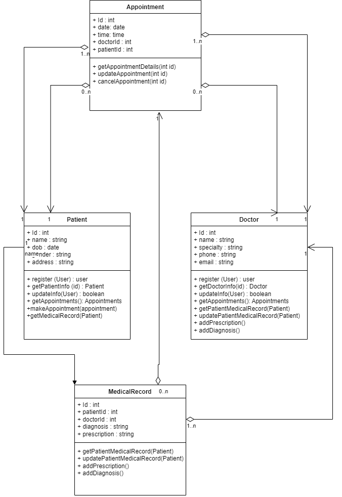

# hospital-management-system
Hospital Management System
This repository contains the source code for a Hospital Management System. The system provides APIs for managing doctors, patients, appointments, and medical records.
# Table of Content
<!-- TOC -->
* [hospital-management-system](#hospital-management-system)
* [Table of Content](#table-of-content)
* [UML Diagram](#uml-diagram)
* [Design Template](#design-template-)
  * [Doctor Api](#doctor-api)
  * [Patient Api](#patient-api)
  * [Appointments](#appointments-)
  * [Medical Records](#medical-records)
  * [Postman](#Postman)
<!-- TOC -->

# UML Diagram
The following UML diagram illustrates the class structure and relationships in the Hospital Management System. It provides an overview of the main entities and their associations within the system. The diagram showcases the relationships between doctors, patients, appointments, and medical records, helping to visualize the system's design and interactions.



#  Design Template 
## Doctor Api
The Doctor API provides endpoints to interact with doctor-related data in a healthcare system. It allows users to perform various operations such as retrieving a doctor's information by ID, adding a new doctor to the system, fetching a list of all doctors, updating doctor details, and deleting a doctor record. The API supports HTTP methods like GET, POST, PUT, and DELETE, and returns appropriate HTTP status codes to indicate the success or failure of each operation. The requests and responses are in JSON format. The API provides a straightforward way to manage doctor information within the healthcare system.

| Http method | URL path         | Http Status Code | Description           | Sample Request                                                                                                                                                                                                 | Sample Response                                                                                                                                                                                           |
|-------------|------------------|------------------|-----------------------|----------------------------------------------------------------------------------------------------------------------------------------------------------------------------------------------------------------|-----------------------------------------------------------------------------------------------------------------------------------------------------------------------------------------------------------|
| GET         | /api/doctor/{id} | 200 / 404        | Get doctor by id      | `GET /api/doctor/1`                                                                                                                                                                                            | ```json {"name : test,"specialty": null,"email": "test@gmail.com","doctorId": 1,"phoneNumber": 555   "}```                                                                                                |
| POST        | /api/doctor      | 201 / 400        | add a new doctor      | ```POST /api/doctor HTTP/1.1 Host: localhost:8080 Content-Type: application/json Content-Length: 134 {"name": "test22","specialty": "Legs","email": "test@gmail.com","doctorId": 5,"phoneNumber": 555123 } ``` | ``` {"name": "test22","doctorId": 5,"email": "test@gmail.com","specialty": null,"phoneNumber": null}```                                                                                                   |
| GET         | /api/doctor      | 200 / 404        | get all doctors list  | `GET /api/doctor HTTP/1.1Host: localhost:8080 Content-Type: application/json Content-Length: 134`                                                                                                              | [``` {"name": "test","doctorId": 1,"email": "test@gmail.com","specialty": null,"phoneNumber": 555},{"name": "test","doctorId": 2,"email": "test@gmail.com","specialty": null,"phoneNumber": null    },``` |
| PUT         | /api/doctor/{id} | 200              | update doctor details | ``` PUT /api/doctor/1 HTTP/1.1 Host: localhost:8080 Content-Type: application/json Content-Length: 126 {"name": "CEO","doctorId": 1,"specialty": "Eyes","phoneNumber": 555,"email": "test@gmail.com"}```       | ```{"name": "CEO","doctorId": 1,"email": "test@gmail.com","phoneNumber": 555,"specialty": "Eyes"}      ```                                                                                                |
| DELETE      | /api/doctor/{id} | 200              | delete doctor from id | `DELETE /api/doctor/5 HTTP/1.1Host: localhost:8080 Content-Type: application/json    `                                                                                                                         | Deleted Successfully                                                                                                                                                                                      |                                                                                                                                                                                                           |

## Patient Api
The Patient API provides endpoints to interact with patient data. It allows retrieving patient information, adding new patients, updating existing patient details, and deleting patients. The API supports the HTTP methods GET, POST, PUT, and DELETE.

- GET /api/patient/{id} retrieves a specific patient's information based on the provided ID. It returns the patient's name, registration date, patient ID, email, phone number, date of birth, and gender.

- GET /api/patient/ retrieves a list of all patients. It returns an array of patient objects, each containing the patient's name, registration date, email, phone number, patient ID, gender, and date of birth.

- POST /api/patient/ creates a new patient. It requires the request body to include the patient's ID, name, date of birth, gender, phone number, email, and registration date. On success, it returns the newly created patient object.

- PUT /api/patient/{id} updates an existing patient's details based on the provided ID. The request body should include the patient's ID, name, date of birth, gender, phone number, email, and registration date. It returns the updated patient object.

- DELETE /api/patient/{id} deletes a patient based on the provided ID. It returns a success message confirming the deletion.

Ensure to include the appropriate HTTP status codes in the responses for successful operations (200 or 201) and error scenarios (404 or 400) to provide meaningful feedback to API consumers.

| Http method | URL path           | Http Status Code | Description              | Sample Request                                                                                                                                                                                                                                                                           | Sample Response                                                                                                                                                                                                                                                                                                                                                                                                                                                                                                                                                                                                                                                                                                                                                                                                                                   |
|-------------|--------------------|------------------|--------------------------|------------------------------------------------------------------------------------------------------------------------------------------------------------------------------------------------------------------------------------------------------------------------------------------|---------------------------------------------------------------------------------------------------------------------------------------------------------------------------------------------------------------------------------------------------------------------------------------------------------------------------------------------------------------------------------------------------------------------------------------------------------------------------------------------------------------------------------------------------------------------------------------------------------------------------------------------------------------------------------------------------------------------------------------------------------------------------------------------------------------------------------------------------|
| GET         | `api/patient/{id}` | 200 / 404        | Get Patient by id        | `GET /api/patient/52 HTTP/1.1 Host: localhost:8080 Content-Type: application/json`                                                                                                                                                                                                       | `{"name":"John Doe","registrationDate":"2023-05-20T00:00:00.000+00:00","patientId":52,"email":"john.doe@example.com","phoneNumber":5555555555,"dateOfBirth":"2023-01-01T00:00:00.000+00:00","gender":"Male"}`                                                                                                                                                                                                                                                                                                                                                                                                                                                                                                                                                                                                                                     |
| GET         | `api/patient/`     | 200 / 404        | Get all patients         | `GET /api/patient/ HTTP/1.1 Host: localhost:8080 Content-Type: application/json`                                                                                                                                                                                                         | `[{"name":"John Doe","registrationDate":"2023-05-20T00:00:00.000+00:00","email":"john.doe@example.com","phoneNumber":5555555555,"patientId":1,"gender":"Male","dateOfBirth":"2023-01-01T00:00:00.000+00:00"},{"name":"John Doe","registrationDate":"2023-05-20T00:00:00.000+00:00","email":"john.doe@example.com","phoneNumber":5555555555,"patientId":2,"gender":"Male","dateOfBirth":"2023-01-01T00:00:00.000+00:00"},{"name":"John Doe","registrationDate":"2023-05-20T00:00:00.000+00:00","email":"john.doe@example.com","phoneNumber":5555555555,"patientId":52,"gender":"Male","dateOfBirth":"2023-01-01T00:00:00.000+00:00"},{"name":"John Doe","registrationDate":"2023-05-20T00:00:00.000+00:00","email":"john.doe@example.com","phoneNumber":5555555555,"patientId":53,"gender":"Male","dateOfBirth":"2023-01-01T00:00:00.000+00:00"}]` |
| POST        | `api/patient/`     | 201 / 400        | Create new patient       | `POST /api/patient/ HTTP/1.1 Host: localhost:8080 Content-Type: application/json Content-Length: 215 {"patientId": 3,"name": "John Doe","dateOfBirth": "2023-01-01","gender": "Male","phoneNumber": 5555555555,"email": "john.doe@example.com","registrationDate": "2023-05-20"}`        | `{"name":"John Doe","registrationDate":"2023-05-20T00:00:00.000+00:00","patientId":53,"email":"john.doe@example.com","phoneNumber":5555555555,"dateOfBirth":"2023-01-01T00:00:00.000+00:00","gender":"Male"}`                                                                                                                                                                                                                                                                                                                                                                                                                                                                                                                                                                                                                                     |
| PUT         | `spi/patient/{id}` | 200 / 404        | Update the patient by id | `PUT /api/patient/102 HTTP/1.1 Host: localhost:8080 Content-Type: application/json Content-Length: 220 {"patientId": 3,"name": "John Ahmad","dateOfBirth": "2023-01-01","gender": "Male","phoneNumber": "05998877601","email": "john.doe@example.com","registrationDate": "2023-05-20"}` | `{"name":"John Ahmad","registrationDate":"2023-05-20T00:00:00.000+00:00","patientId":102,"phoneNumber":5998877601,"email":"john.doe@example.com","dateOfBirth":"2023-01-01T00:00:00.000+00:00","gender":"Male"}`                                                                                                                                                                                                                                                                                                                                                                                                                                                                                                                                                                                                                                  |
| DELETE      | `api/patient/{id}` | 200 / 404        | Delete patient           | `DELETE /api/patient/103 HTTP/1.1Host: localhost:8080 Content-Type: application/json Content-Length: 220`                                                                                                                                                                                | `Patient Deleted`                                                                                                                                                                                                                                                                                                                                                                                                                                                                                                                                                                                                                                                                                                                                                                                                                                 |

## Appointments 

The Appointments API allows users to manage appointments within the system. It provides various endpoints to retrieve, create, update, and delete appointments.

- Get appointments by id/number: This endpoint retrieves an appointment based on its unique identifier. Users can specify the appointment ID in the URL path to fetch the corresponding appointment.

- Get all appointments: This endpoint returns a list of all appointments available in the system. Users can make a GET request to retrieve the complete list of appointments.

- Get all appointments for DoctorId: Users can retrieve all appointments associated with a specific doctor by providing the doctor's ID in the URL path.

- Get all appointments for PatientId: This endpoint allows users to fetch all appointments for a particular patient by providing the patient's ID in the URL path.

- Add new appointment: Users can create a new appointment by making a POST request to this endpoint. They need to provide the necessary information, such as the appointment date, start and end time, appointment type, status, doctor ID, and patient ID.

- Update appointment: This endpoint enables users to update an existing appointment. Users need to provide the appointment ID in the URL path and include the updated information in the request body.

- Delete appointment: Users can delete an appointment by specifying its ID in the URL path and making a DELETE request.

| Http method | URL path                          | Http Status Code | Description                         | Sample Request                                                                                                                                                                                                                                                                                                          | Sample Response                                                                                                                                                                                                                                                                                                                                                                                               |
|-------------|-----------------------------------|------------------|-------------------------------------|-------------------------------------------------------------------------------------------------------------------------------------------------------------------------------------------------------------------------------------------------------------------------------------------------------------------------|---------------------------------------------------------------------------------------------------------------------------------------------------------------------------------------------------------------------------------------------------------------------------------------------------------------------------------------------------------------------------------------------------------------|
| GET         | `api/appointments/{id}`           | 200 / 404        | Get appointments by id/number       | `GET /api/appointments/1 HTTP/1.1 Host: localhost:8080 Content-Type: application/json  `                                                                                                                                                                                                                                | `{"type":"General","date":"2023-05-21T00:00:00","startTime":"09:00:00","endTime":"10:00:00","status":"Scheduled","doctorId":1,"appointmentId":1,"patientId":1,"creationDate":"2023-05-20T14:30:00"} `                                                                                                                                                                                                         |
| GET         | `api/appointments/`               | 200 / 400        | Get all appointments                | `GET /api/appointments/ HTTP/1.1 Host: localhost:8080 Content-Type: application/json`                                                                                                                                                                                                                                   | `[{"type":"General","date":"2023-05-21T00:00:00","startTime":"09:00:00","endTime":"10:00:00","appointmentId":1,"patientId":1,"doctorId":1,"status":"Scheduled","creationDate":"2023-05-20T14:30:00"},{"type":"General","date":"2023-05-21T00:00:00","startTime":"09:00:00","endTime":"10:00:00","appointmentId":2,"patientId":1,"doctorId":1,"status":"Pending","creationDate":"2023-05-20T14:30:00"}]`       |
| GET         | `api/appointments/doctor/{id}`    | 200 / 404        | Get All appointments for DoctorId   | `GET /api/appointments/doctor/1 HTTP/1.1 Host: localhost:8080 Content-Type: application/json`                                                                                                                                                                                                                           | `[{"type":"General","date":"2023-05-21T00:00:00","startTime":"09:00:00","endTime":"10:00:00","appointmentId":1,"patientId":1,"doctorId":1,"status":"Scheduled","creationDate":"2023-05-20T14:30:00"},{"type":"General","date":"2023-05-21T00:00:00","startTime":"09:00:00","endTime":"10:00:00","appointmentId":2,"patientId":1,"doctorId":1,"status":"Pending","creationDate":"2023-05-20T14:30:00"}]`       |
| GET         | `api/appointments/patient/{id}`   | 200 / 404        | Get all appointments for PatientId  | `GET /api/appointments/patient/2 HTTP/1.1 Host: localhost:8080 Content-Type: application/json`                                                                                                                                                                                                                          | `[{"type":"Critical","date":"2023-05-21T10:00:00","startTime":"10:00:00","endTime":"11:00:00","status":"Schedualed","patientId":2,"doctorId":2,"creationDate":"2023-05-22T14:30:00","appointmentId":1},{"type":"Critical","date":"2023-05-22T00:00:00","startTime":"10:00:00","endTime":"11:00:00","status":"Approved","patientId":2,"doctorId":1,"creationDate":"2023-05-22T14:30:00","appointmentId":104}]` |
| POST        | `api/appointments/`               | 201 / 404        | Add new appointment                 | `POST /api/appointments/ HTTP/1.1 Host: localhost:8080 Content-Type: application/json Content-Length: 259 {"appointmentId": 1,"date": "2023-05-21T00:00:00","startTime": "09:00:00","endTime": "10:00:00","type": "General","status": "Scheduled","creationDate": "2023-05-20T14:30:00","doctorId": 1,"patientId": 1 }` | `{"type":"General","date":"2023-05-21T00:00:00","startTime":"09:00:00","endTime":"10:00:00","status":"Scheduled","doctorId":1,"patientId":1,"appointmentId":1,"creationDate":"2023-05-20T14:30:00"}`                                                                                                                                                                                                          |
| PUT         | `api/appointments/{id}`           | 200 / 404        | Update appointment                  | `PUT /api/appointments/ HTTP/1.1 Host: localhost:8080 Content-Type: application/json Content-Length: 259 {"type": "Normal","date": "2023-05-21T10:00:00","status": "Schedualed","patientId": 2,"appointmentId": 1,"doctorId": 1,"creationDate": "2023-05-22T14:30:00","endTime": "11:00:00","startTime": "10:00:00"}`   | `{"type":"Normal","date":"2023-05-21T10:00:00","status":"Schedualed","patientId":2,"appointmentId":1,"doctorId":1,"creationDate":"2023-05-22T14:30:00","endTime":"11:00:00","startTime":"10:00:00"}`                                                                                                                                                                                                          |
| DELETE      | `api/appointments/{id}`           | 200 / 404        | Delete appointment                  | `DELETE /api/appointments/202 HTTP/1.1 Host: localhost:8080 Content-Type: application/json`                                                                                                                                                                                                                             | `Appointment Was Deleted `                                                                                                                                                                                                                                                                                                                                                                                    |

## Medical Records
The Medical Records API allows users to manage medical records within the system. It provides several endpoints to create, retrieve, update, and delete medical records.

- Create New Medical Record: Users can create a new medical record by making a POST request to this endpoint. They need to provide relevant information such as the last modified date, doctor ID, patient ID, appointment ID, medical record ID, diagnosis, and treatment.

- Get Medical Record By ID: This endpoint retrieves a medical record based on its unique identifier. Users can specify the record ID in the URL path to fetch the corresponding medical record.

- Get all Medical Records: Users can retrieve a list of all medical records available in the system by making a GET request to this endpoint.

- Update Medical Record: Users can update an existing medical record by making a PUT request to this endpoint. They need to provide the record ID in the URL path and include the updated information in the request body.

- Delete Medical Record: Users can delete a medical record by specifying its ID in the URL path and making a DELETE request.

- Get All Records For Patient: This endpoint allows users to fetch all medical records associated with a specific patient. Users need to provide the patient's ID in the URL path to retrieve the relevant records.

- Get All Records Add by Doctor: Users can retrieve all medical records added by a particular doctor by providing the doctor's ID in the URL path.

- Get Medical Records For Appointment: Users can retrieve the medical records associated with a specific appointment by providing the appointment's ID in the URL path.

| Http method | URL path                      | Http Status Code      | Description                         | Sample Request                                                                                                                                                                                                                                                                         | Sample Response                                                                                                                                                                                                                                                                                                                                      |
|-------------|-------------------------------|-----------------------|-------------------------------------|----------------------------------------------------------------------------------------------------------------------------------------------------------------------------------------------------------------------------------------------------------------------------------------|------------------------------------------------------------------------------------------------------------------------------------------------------------------------------------------------------------------------------------------------------------------------------------------------------------------------------------------------------|
| POST        | `api/records/`                | 201 / 400 / 404 / 409 | Create New Medical Record           | `POST /api/records/ HTTP/1.1 Host: localhost:8080 Content-Type: application/json Content-Length: 216 {"lastModifiedDate": "2023-05-22T10:30:00","doctorId": 1,"patientId": 1,"appointmentId": 1,"medicalRecordId": 1,"diagnosis": "some diagnosis","treatment": "some treatment"}`     | `{"lastModifiedDate":"2023-05-22T10:30:00","doctorId":1,"medicalRecordId":1,"patientId":1,"appointmentId":1,"treatment":"some treatment","diagnosis":"some diagnosis"}`                                                                                                                                                                              | 
| GET         | `api/records/{id}`            | 200 / 404             | Get Medical Record By Id            | `GET /api/records/1 HTTP/1.1 Host: localhost:8080 Content-Type: application/json`                                                                                                                                                                                                      | `{"lastModifiedDate":"2023-05-22T10:30:00","doctorId":1,"medicalRecordId":1,"patientId":1,"appointmentId":1,"diagnosis":"some diagnosis","treatment":"some treatment"} `                                                                                                                                                                             | 
| GET         | `api/records/`                | 200                   | Get all Medical Records             | `GET /api/records/ HTTP/1.1 Host: localhost:8080 Content-Type: application/json`                                                                                                                                                                                                       | `[{"lastModifiedDate":"2023-05-22T10:30:00","medicalRecordId":1,"patientId":1,"doctorId":1,"appointmentId":1,"diagnosis":"some diagnosis","treatment":"some treatment"},{"lastModifiedDate":"2023-05-22T10:30:00","medicalRecordId":2,"patientId":1,"doctorId":1,"appointmentId":2,"diagnosis":"some diagnosis","treatment":"some treatment"}] `     | 
| UPDATE      | `api/records/{id}`            | 200 / 404             | Update Medical Record               | `PUT /api/records/1 HTTP/1.1 Host: localhost:8080 Content-Type: application/json Content-Length: 220 {"lastModifiedDate": "2023-05-22T10:30:00","medicalRecordId": 1,"patientId": 1,"doctorId": 1,"appointmentId": 1,"diagnosis": "some diagnosis","treatment": "some treatment2222"}` | `{"lastModifiedDate":"2023-05-22T10:30:00","doctorId":1,"appointmentId":1,"patientId":1,"medicalRecordId":1,"treatment":"some treatment2222","diagnosis":"some diagnosis"}`                                                                                                                                                                          | 
| DELETE      | `api/records/{id}`            | 200 / 404             | Delete Medical Record               | `DELETE /api/records/2 HTTP/1.1 Host: localhost:8080 Content-Type: application/json`                                                                                                                                                                                                   | `Medical Record was Deleted!`                                                                                                                                                                                                                                                                                                                        | 
| GET         | `api/records/patient/{id}`    | 200 / 404             | Get All Records For Patient         | `GET /api/records/patient/1 HTTP/1.1 Host: localhost:8080 Content-Type: application/json`                                                                                                                                                                                              | `[{"lastModifiedDate":"2023-05-22T10:30:00","doctorId":1,"patientId":1,"appointmentId":1,"medicalRecordId":1,"diagnosis":"some diagnosis","treatment":"some treatment2222"},{"lastModifiedDate":"2023-05-22T10:30:00","doctorId":1,"patientId":1,"appointmentId":2,"medicalRecordId":2,"diagnosis":"some diagnosis","treatment":"some treatment"}] ` | 
| GET         | `api/records/doctor/{id}`     | 200 / 404             | Get All Records Add by Doctor       | `GET /api/records/doctor/1 HTTP/1.1 Host: localhost:8080 Content-Type: application/json`                                                                                                                                                                                               | `[{"lastModifiedDate":"2023-05-22T10:30:00","diagnosis":"some diagnosis","treatment":"some treatment2222","medicalRecordId":1,"appointmentId":1,"doctorId":1,"patientId":1},{"lastModifiedDate":"2023-05-22T10:30:00","diagnosis":"some diagnosis","treatment":"some treatment","medicalRecordId":2,"appointmentId":2,"doctorId":1,"patientId":1}] ` | 
| GET         | `api/record/appointment/{id}` | 200 / 404             | Get Medical Records For Appointment | `GET /api/records/appointment/1 HTTP/1.1 Host: localhost:8080 Content-Type: application/json`                                                                                                                                                                                          | `{"lastModifiedDate":"2023-05-22T10:30:00","treatment":"some treatment2222","diagnosis":"some diagnosis","medicalRecordId":1,"doctorId":1,"patientId":1,"appointmentId":1}  `                                                                                                                                                                        |


# Postman 
Click here to see postman documentation [here](./Postman)
